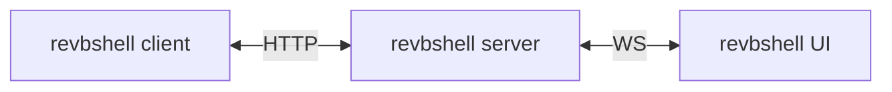

# revbshell server

This project is based on revbshell by bitsadmin: https://github.com/bitsadmin/revbshell

```mermaid
graph LR
    A[revbshell client] <-- HTTP --> B[revbshell server]
    B <-- WS --> C[revbshell UI]
```
